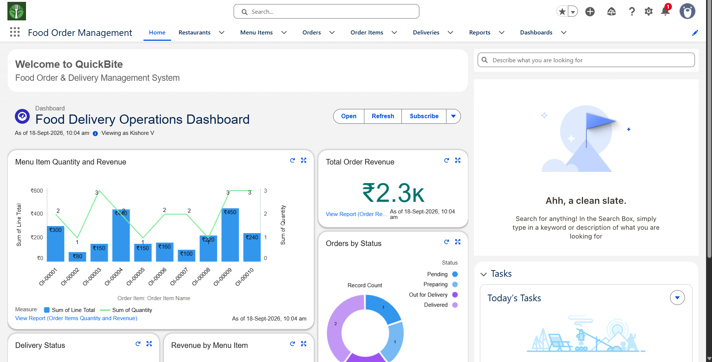
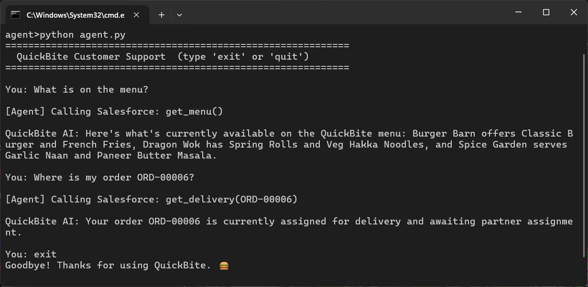
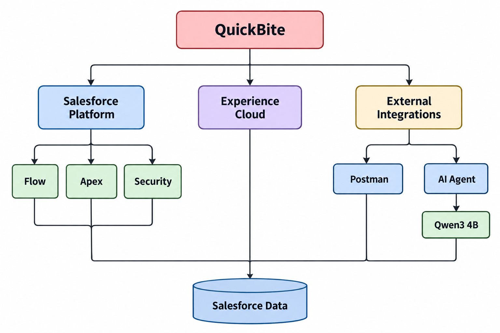

# QuickBite: Sistem Manajemen Pesanan Makanan Salesforce dengan Integrasi AI

[English](../README.md) | [தமிழ்](README_TA.md) | [简体中文](README_ZH.md) | [हिन्दी](README_HI.md) | Bahasa Indonesia

Platform manajemen pengiriman makanan berbasis Salesforce untuk mengelola restoran, menu, pesanan pelanggan, pengiriman, otomatisasi, pelaporan, akses pelanggan, REST API, dan dukungan berbasis AI.



---

## Fitur

- **Manajemen Restoran & Menu** - Mengelola restoran, jenis masakan, item menu, harga, dan ketersediaan.

- **Manajemen Pesanan** - Mengelola pesanan pelanggan, item pesanan, perhitungan total otomatis, dan validasi status.

- **Manajemen Pengiriman** - Membuat pengiriman, menetapkan mitra pengiriman, melacak status, dan melakukan sinkronisasi.

- **Otomatisasi** - Record-Triggered Flow untuk pesanan, pengiriman, pembaruan status, dan notifikasi.

- **Pengembangan Apex** - Service Class, Trigger, logika bisnis, dan Apex REST Controller.

- **Keamanan** - OWD, Role Hierarchy, Permission Set, Sharing Rule, dan Field-Level Security.

- **Experience Cloud** - Portal pelanggan untuk melihat restoran, menu, pesanan, dan informasi pengiriman.

- **Reports & Dashboard** - Analitik operasional dan pendapatan.

- **REST API** - Integrasi dengan sistem eksternal melalui Apex REST Endpoint khusus.

- **Postman** - Pengujian dan demonstrasi API.

- **Dukungan AI Lokal** - Agent Qwen3 4B + Ollama untuk menangani pertanyaan FAQ, menu, pesanan, dan pengiriman.



> AI Assistant merupakan integrasi AI lokal dan bukan Salesforce Agentforce.

---

## Arsitektur



---

## Model Data

```text
Restaurant
    |
    └── Menu Item

Contact
    |
    └── Order
          |
          └── Order Item
          |
          └── Delivery
                |
                └── Delivery Partner (Contact)
```

### Objek Inti

| Object          | Kegunaan                         |
| --------------- | -------------------------------- |
| `Restaurant__c` | Informasi restoran               |
| `Menu_Item__c`  | Item menu restoran               |
| `Order__c`      | Pesanan pelanggan                |
| `Order_Item__c` | Item yang terdapat dalam pesanan |
| `Delivery__c`   | Informasi pengiriman pesanan     |

---

## Siklus Hidup Pesanan

```text
Pending → Accepted → Preparing → Out for Delivery → Delivered
                  \
                   → Cancelled
```

## Siklus Hidup Pengiriman

```text
Assigned → Picked Up → Out for Delivery → Delivered
```

---

## Apex

Komponen Apex utama:

* `OrderService` - Pembuatan pesanan, pengambilan data, pembaruan status, dan logika bisnis.

* `OrderTotalCalculator` - Perhitungan total pesanan dengan pendekatan Bulkified.

* `DeliveryChargeCalculator` - Perhitungan biaya pengiriman.

* `OrderItemTrigger` - Memperbarui total pesanan ketika item pesanan mengalami perubahan.

* `MenuRestController` - Menu REST API.

* `OrderRestController` - Order REST API.

* `DeliveryRestController` - Delivery REST API.

Apex Tests mencakup pengujian Trigger, Service, perhitungan, validasi, dan fungsionalitas REST.

---

## REST API

| Method | Endpoint                             | Kegunaan                      |
| ------ | ------------------------------------ | ----------------------------- |
| `GET`  | `/services/apexrest/menu`            | Mendapatkan menu              |
| `GET`  | `/services/apexrest/orders/{id}`     | Mendapatkan informasi pesanan |
| `POST` | `/services/apexrest/orders`          | Membuat pesanan               |
| `PUT`  | `/services/apexrest/orders/{id}`     | Memperbarui status pesanan    |
| `GET`  | `/services/apexrest/deliveries/{id}` | Melacak pengiriman            |

---

## Keamanan

Aplikasi menggunakan fitur keamanan Salesforce berikut:

* Organization-Wide Defaults
* Role Hierarchy
* Permission Sets
* Sharing Rules
* Field-Level Security
* Experience Cloud Sharing Sets

Role yang tersedia:

```text
CEO
 └── Restaurant Operations Manager
      ├── Restaurant Staff
      └── Delivery Partner
```

---

## Experience Cloud

**QuickBite Customer Portal** memberikan pelanggan akses ke:

* Restaurants
* Menu Items
* My Orders
* Order Items
* Delivery Information

---

## Local AI Agent

Agent berada di:

```text
scripts/quickbite-agent/
```

Agent menggunakan **Qwen3 4B melalui Ollama** dan terhubung ke Salesforce melalui REST API.

Tools yang tersedia:

```text
get_menu()
get_order(order_name)
get_delivery(order_name)
```

Agent menggunakan Knowledge Base FAQ lokal dan data Salesforce sebagai **source of truth** untuk informasi pesanan dan pengiriman yang bersifat dinamis.

Agent dapat menangani pertanyaan seperti:

```text
"What’s on the menu?"

"What is the status of order ORD-00001?"

"Where is my order ORD-00006?"

"What does 'Pending' mean?"
```

Agent menggunakan data aktual yang tersedia di Salesforce dan Knowledge Base FAQ untuk memberikan jawaban, bukan membuat asumsi atau mengarang informasi yang tidak memiliki dasar.

---

## Struktur Proyek

```text
Food-management-system/
├── force-app/
│   └── main/default/
│       ├── classes/
│       ├── triggers/
│       ├── objects/
│       ├── flows/
│       ├── layouts/
│       ├── permissionsets/
│       ├── tabs/
│       └── applications/
│
├── scripts/
│   └── quickbite-agent/
│       ├── agent.py
│       ├── tools.py
│       ├── salesforce.py
│       ├── knowledge.py
│       ├── config.py
│       └── knowledge/
│           └── faq.md
│
├── docs/
│   └── img/
│
├── sfdx-project.json
└── README.md
```

---

## Teknologi yang Digunakan

**Salesforce:** Apex, SOQL, Flow, Lightning App, Experience Cloud, Reports, Dashboards

**Integrasi:** Apex REST, Postman, Salesforce CLI

**AI:** Python, Ollama, Qwen3 4B

**Pengembangan:** VS Code, Git, GitHub

---

## Instalasi dan Pengaturan

### Salesforce

```bash
sf org login web
sf project deploy start --target-org FoodOrderOrg --source-dir force-app
sf apex run test --target-org FoodOrderOrg --test-level RunLocalTests
```

### Local AI Agent

```bash
cd scripts/quickbite-agent
pip install -r requirements.txt
ollama pull qwen3:4b
python agent.py
```

---

## Lisensi

Proyek ini menggunakan **MIT License**. Lihat file [LICENSE](LICENSE) untuk informasi lebih lanjut.